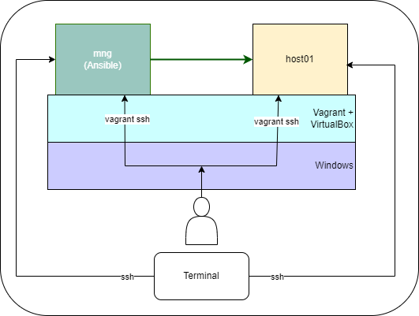

# Домашнее задание 2. Ansible

### Задача

Подготовить стенд на Vagrant как минимум с одним сервером. На этом сервере используя Ansible необходимо развернуть nginx со следующими условиями:

- необходимо использовать модуль yum/apt
- конфигурационные файлы должны быть взяты из шаблона jinja2 с
переменными
- после установки nginx должен быть в режиме enabled в systemd
- должен быть использован notify для старта nginx после установки
- сайт должен слушать на нестандартном порту - 8080, для этого использовать
переменные в Ansible
- Сделать все это с использованием Ansible роли

Домашнее задание считается принятым, если:

- предоставлен Vagrantfile и готовый playbook/роль ( инструкция по запуску
стенда, если посчитаете необходимым )
- после запуска стенда nginx доступен на порту 8080
- при написании playbook/роли соблюдены перечисленные в задании условия

## Подготовка стенда

*Оказалось, что мой процессор староват и не поддерживает Nested VT-x. Пришлось поднимать 2 виртуалки*

Для отработки подготавливаем две виртуальные машины в VirtualBox: 



**mng** (ip: 192.168.0.210) - управляющий хост:

```ruby
Vagrant.configure("2") do |config|
    # образ системы
    config.vm.box = "ubuntu/focal64"

    # hostname виртуальной машины
    config.vm.hostname = "mng"

    # не проверять репозиторий на наличие обновлений
    config.vm.box_check_update = false

    # поброс папки
    #config.vm.synced_folder ".", "/home/vagrant/ansible"
    
    # настройка сети (сетевой мост на втором интерфейсе)
    #config.vm.network "private_network", virtualbox__intnet: "intnet", ip: "192.168.10.10"
    config.vm.network "public_network", bridge: "Realtek PCIe GbE Family Controller", ip: "192.168.0.210"

    # Устанавливаем параметры виртуальной машины
    config.vm.provider "virtualbox" do |vb|   
        vb.name = "mng" 
        vb.memory = "768"
        vb.cpus = "1"
    end

    # Устанавливаем Ansible
    config.vm.provision "shell", inline: <<-SHELL
      sudo apt update
      sudo apt install software-properties-common -y
      sudo apt-add-repository --yes --update ppa:ansible/ansible
      sudo apt install ansible -y
    SHELL
end
```

**host01** (ip: 192.168.0.29) - управляемый хост:

```ruby
Vagrant.configure("2") do |config|
    # образ системы
    config.vm.box = "centos/7"

    # hostname виртуальной машины
    config.vm.hostname = "host01"
    
    # не проверять репозиторий на наличие обновлений
    config.vm.box_check_update = false
    
    # настройка сети (сетевой мост на втором интерфейсе)
    config.vm.network "public_network", bridge: "Realtek PCIe GbE Family Controller", ip: "192.168.0.29"
    #config.vm.network "public_network", bridge: "Realtek PCIe GbE Family Controller"

    config.vm.provider "virtualbox" do |vb|
      vb.name = "host01"
      vb.memory = 512
      vb.cpus = 1
    end
end
```

Параметры ssh хоста host01

```ruby
vagrant ssh-config
Host default
  HostName 127.0.0.1
  User vagrant
  Port 2200
  UserKnownHostsFile /dev/null
  StrictHostKeyChecking no
  PasswordAuthentication no
  IdentityFile G:/OTUS/dz02/host01/.vagrant/machines/default/virtualbox/private_key
  IdentitiesOnly yes
  LogLevel FATAL
  PubkeyAcceptedKeyTypes +ssh-rsa
  HostKeyAlgorithms +ssh-rsa
```

Содержимое файла dz02/host01/.vagrant/machines/default/virtualbox/private_key необходимо скопировать в файл private.key (выставляем права 0600) на хост mng, что бы можно было подключаться к host01 по ssh.

**Архив с плейбуком и настройками ansible_conf.zip необходимо распаковать на хосте mng**
В файле host проверить актуальный ip-адрес для host01

*Этот момент с ключом и архивом меня смущает. Я не знаю как это сделать красиво (⊙_⊙;)*

```bash
[web]
nginx ansible_host=192.168.0.29 ansible_port=22 ansible_user=vagrant ansible_private_key_file=~/private.key
```

С хоста mng выполнить проверку доступности хоста 

```bash
vagrant@ansible0:~$ ansible nginx -i ansible/inventory -m ping
nginx | SUCCESS => {
    "ansible_facts": {
        "discovered_interpreter_python": "/usr/bin/python3"
    },
    "changed": false,
    "ping": "pong"
}
```

Запустить плейбук для установки nginx

```bash
ansible-playbook playbooks/nginx.yml
PLAY [NGINX | Install and configure NGINX] ***************************************************************
...
PLAY RECAP ***********************************************************************************************
nginx                      : ok=6    changed=5    unreachable=0    failed=0    skipped=0    rescued=0    ignored=0
```

Проверить, что по адресу открывается web-страница

```bash
curl http://192.168.0.29:8080
<!DOCTYPE HTML PUBLIC "-//W3C//DTD HTML 4.01 Transitional//EN">
<html>
<head>
  <title>Welcome to CentOS</title>
  <style rel="stylesheet" type="text/css">
...
```
