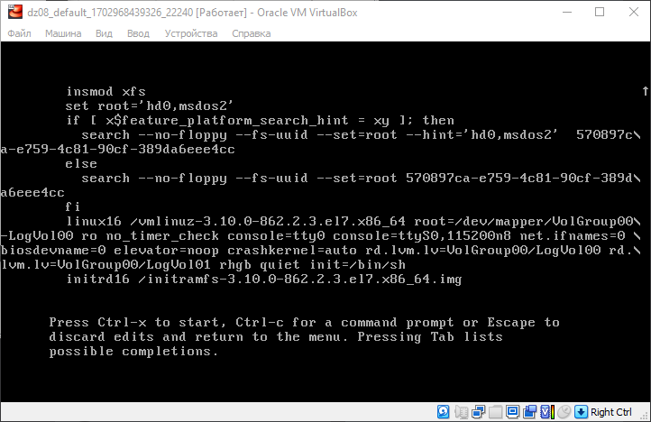

# Домашнее задание 8. Загрузка Linux

## Задание

1. Попасть в систему без пароля несколькими способами
2. Установить систему с LVM, после чего переименовать VG
3. Добавить модуль в initrd

# Решение

## 1. Попасть в систему без пароля несколькими способами

При запуске ВМ (grub) нажимаем клавишу **e** и переходим в режим редактирования. 

### Способ 1

В конце строки начинающейся на linux16 дописываем **init=/bin/sh.** Нажимаем Ctrl+x для перехода в режим отладки (emergency mode).



### Способ 2

При запуске ВМ (grub) нажимаем клавишу **e** и переходим в режим редактирования. В конце строки начинающейся на linux16 дописываем **rd.break**


### Способ 3

В строке начинающейся на linux16 заменяем ro на rw init=/sysroot/bin/sh 


В 1 и 2 способе так же можно поменять ro на rw. Если этого не сделано этого, то необходимо перемонтировать корневую систему в режиме rw.

```bash
mount -o remount,rw /sysroot
```

Далее для всех способов необходимо выполнить смену корневой директории

```bash
chroot /sysroot
```

После чего можно сменить пароль root-а задав новый.

```bash
passwd root
```

Далее обновляем информацию в selinux и перегружаем

```bash
touch /.autorelabel
reboot
```

## 2. Установить систему с LVM, после чего переименовать VG

Используем vagrant-box centos/7 version 1804.02, в котором корневой раздел расположен на LVM (для 2-го задания)

```jsx
df -h /
Filesystem                       Size  Used Avail Use% Mounted on
/dev/mapper/VolGroup00-LogVol00   38G  877M   37G   3% /

vgs
  VG         #PV #LV #SN Attr   VSize   VFree
  VolGroup00   1   2   0 wz--n- <38.97g    0
```

Переименовываем VG

```jsx
vgrename VolGroup00 vg0
  Volume group "VolGroup00" successfully renamed to "vg0"
```

Заменяем наименование группы в:

- /etc/fstab
- /etc/default/grub

Пересоздаем исполняемый конфиг GRUB

```jsx
grub2-mkconfig -o /boot/grub2/grub.cfg
```

Пересоздаем initrd image, чтобы он знал новое название Volume Group

```jsx
mkinitrd -f -v /boot/initramfs-$(uname -r).img $(uname -r)
Executing: /sbin/dracut -f -v /boot/initramfs-3.10.0-862.2.3.el7.x86_64.img 3.10.0-862.2.3.el7.x86_64
...
*** Creating initramfs image file '/boot/initramfs-3.10.0-862.2.3.el7.x86_64.img' done ***
```

Перегружаем и проверяем после перезагрузки

```jsx
vgs
  VG  #PV #LV #SN Attr   VSize   VFree
  vg0   1   2   0 wz--n- <38.97g    0

df -h /
Filesystem                Size  Used Avail Use% Mounted on
/dev/mapper/vg0-LogVol00   38G  878M   37G   3% /
```

## 3. Добавить модуль в init.rd

Добавляем свой модуль 01test путем создания директории 

 

```jsx
mkdir /usr/lib/dracut/modules.d/01test
```

Размещаем в ней два скрипта

1. [module-setup.sh](https://gist.github.com/lalbrekht/e51b2580b47bb5a150bd1a002f16ae85) - который устанавливает модуль и вызывает скрипт test.sh
2. [test.sh](https://gist.github.com/lalbrekht/ac45d7a6c6856baea348e64fac43faf0) - собственно сам вызываемый скрипт, в нём у нас рисуется пингвинчик

```jsx
cd /usr/lib/dracut/modules.d/01test
curl https://gist.githubusercontent.com/lalbrekht/e51b2580b47bb5a150bd1a002f16ae85/raw/80060b7b300e193c187bbcda4d8fdf0e1c066af9/gistfile1.txt -s -o module-setup.sh
curl https://gist.githubusercontent.com/lalbrekht/ac45d7a6c6856baea348e64fac43faf0/raw/69598efd5c603df310097b52019dc979e2cb342d/gistfile1.txt -s -o test.sh

chmod +x *.sh
ll
total 8
-rwxr-xr-x. 1 root root 126 Dec 19 13:45 module-setup.sh
-rwxr-xr-x. 1 root root 334 Dec 19 13:46 test.sh
```

Пересобираем образ initrd

```jsx
mkinitrd -f -v /boot/initramfs-$(uname -r).img $(uname -r)
Executing: /sbin/dracut -f -v /boot/initramfs-3.10.0-862.2.3.el7.x86_64.img 3.10.0-862.2.3.el7.x86_64
...
*** Creating initramfs image file '/boot/initramfs-3.10.0-862.2.3.el7.x86_64.img' done ***

# Как альтернативу можно использовать   dracut -f -v
```

проверить/посмотреть какие модули загружены в образ:
 lsinitrd -m /boot/initramfs-$(uname -r).img | grep test
test

```jsx
 lsinitrd -m /boot/initramfs-$(uname -r).img | grep test
test
```

Перезагружаем и отключаем опции rghb и quiet в grub


после чего видим пингвинчика


--------------------