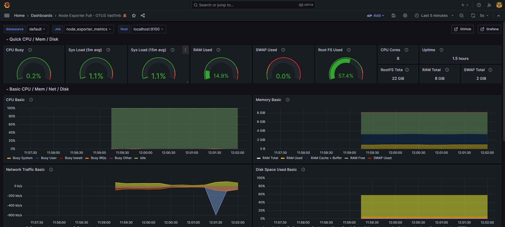
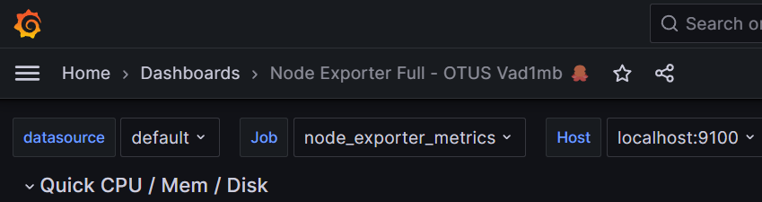

# Домашнее задание 15. Prometheus+Grafana.

## Задание

Настройка мониторинга

**Цель:**

научиться настраивать дашборд;

**Описание/Пошаговая инструкция выполнения домашнего задания:**

Что нужно сделать?

Настроить дашборд с 4-мя графиками

- память;
- процессор;
- диск;
- сеть.

Настроить на одной из систем:

- zabbix (использовать screen (комплексный экран);
- prometheus - grafana.

# Решение

Производим установку и настройку Prometheus + Grafana

В качестве хоста - ВМ с Ubuntu.
На него производится вся установка ПО и его же мониторим.

Делаем проброс портов на ВМ:

- Prometheus -- **9090**
- Grafana -- **3000**

### Prometheus

Переходим на [официальную страницу загрузки](https://prometheus.io/download/) и загружаем последнюю версию.

```jsx
wget https://github.com/prometheus/prometheus/releases/download/v2.49.1/prometheus-2.49.1.linux-386.tar.gz
tar -xvf prometheus-2.49.1.linux-386.tar.gz
mv prometheus-2.49.1.linux-386 prometheus-files
cp prometheus-files/prometheus /usr/local/bin/
cp prometheus-files/promtool /usr/local/bin/
chown prometheus:prometheus /usr/local/bin/prometheus
chown prometheus:prometheus /usr/local/bin/promtool
```

Создаем пользователя prometheus

```jsx
useradd --no-create-home --shell /bin/false prometheus
```

Настройка конфигурации

```jsx
mkdir /etc/prometheus
mkdir /var/lib/prometheus
chown prometheus:prometheus /etc/prometheus
chown prometheus:prometheus /var/lib/prometheus
cp -r prometheus-files/consoles /etc/prometheus
cp -r prometheus-files/console_libraries /etc/prometheus
chown -R prometheus:prometheus /etc/prometheus/consoles
chown -R prometheus:prometheus /etc/prometheus/console_libraries
```

Прописываем в /etc/prometheus/prometheus.yml

```jsx
global:
  scrape_interval: 10s

scrape_configs:
  - job_name: 'prometheus'
    scrape_interval: 5s
    static_configs:
      - targets: ['localhost:9090']
```

```jsx
chown prometheus:prometheus /etc/prometheus/prometheus.yml
```

Конфигурируем как сервис

/etc/systemd/system/prometheus.service:

```jsx
[Unit]
Description=Prometheus Service
After=network.target

[Service]
User=prometheus
Group=prometheus
Type=simple
ExecStart=/usr/local/bin/prometheus \
--config.file /etc/prometheus/prometheus.yml \
--storage.tsdb.path /var/lib/prometheus/ \
--web.console.templates=/etc/prometheus/consoles \
--web.console.libraries=/etc/prometheus/console_libraries
ExecReload=/bin/kill -HUP $MAINPID
Restart=on-failure

[Install]
WantedBy=multi-user.target
```

```jsx
systemctl daemon-reload
systemctl start prometheus
systemctl status prometheus
```

Проверяем, что сервис запущен и работает

### Exporter

Скачиваем экспортер

```jsx
wget https://github.com/prometheus/node_exporter/releases/download/v1.7.0/node_exporter-1.7.0.linux-amd64.tar.gz
tar -xvf node_exporter-1.7.0.linux-amd64.tar.gz
mv node_exporter-1.7.0.linux-amd64/node_exporter /usr/local/bin/

useradd -rs /bin/false node_exporter
```

Конфигурируем как сервис

/etc/systemd/system/node_exporter.service:

```jsx
[Unit]
Description=Node Exporter
After=network.target

[Service]
User=node_exporter
Group=node_exporter
Type=simple
ExecStart=/usr/local/bin/node_exporter

[Install]
WantedBy=multi-user.target
```

```jsx
systemctl daemon-reload
systemctl start prometheus
systemctl status prometheus
```

Проверяем, что сервис запущен и работает

### Grafana

ПО заблокировано для прямого доступа. Настраиваем VPN и работаем через него.

Устанавливаем Wireguard и получаем бесплатный доступ скачивая конфигурацию через бота в Telegram - [https://t.me/FineVPNbot](https://t.me/FineVPNbot)

Добавляем репозиторий

```jsx
apt install curl
wget -q -O - https://packages.grafana.com/gpg.key | sudo apt-key add - \
&& sudo add-apt-repository "deb https://packages.grafana.com/oss/deb stable main"
```

Обновляем и устанавливаем

```jsx
apt update
apt install grafana
systemctl start grafana-server
systemctl enable grafana-server
systemctl status grafana-server
```

Проверяем, что сервис запущен и работает

Заходим через веб-интерфейс Grafana - [http://localhost:3000/](http://localhost:3000/)

На сайте [https://grafana.com/grafana/dashboards](https://grafana.com/grafana/dashboards/1860-node-exporter-full/) выбираем подходящий дашборд
(например - [https://grafana.com/grafana/dashboards/1860-node-exporter-full/](https://grafana.com/grafana/dashboards/1860-node-exporter-full/)) и устанавливаем его. Изменяем его под свои потребности.



дашборд должен содержать в названии имя приславшего


