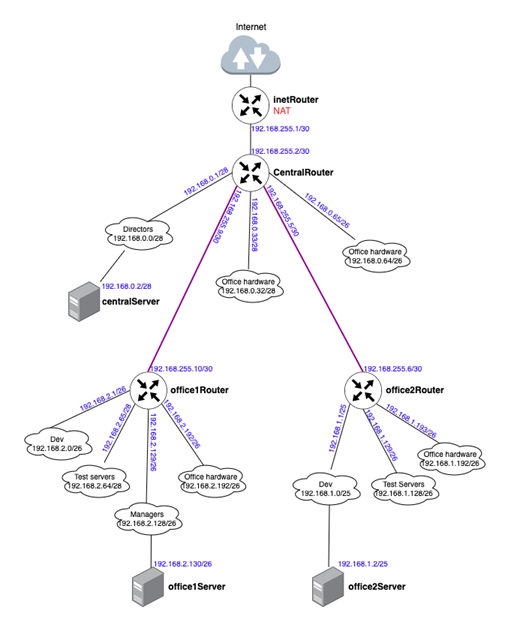

# Домашнее задание 18. Архитектура сетей.

## Цель домашнего задания

Научится менять базовые сетевые настройки в Linux-based системах.

**Задание состоит из 2-х частей: теоретической и практической.**

В теоретической части требуется:

- Найти свободные подсети
- Посчитать количество узлов в каждой подсети, включая свободные
- Указать Broadcast-адрес для каждой подсети
- Проверить, нет ли ошибок при разбиении

В практической части требуется:

- Соединить офисы в сеть согласно логической схеме и настроить роутинг
- Интернет-трафик со всех серверов должен ходить через inetRouter
- Все сервера должны видеть друг друга (должен проходить ping)
- У всех новых серверов отключить дефолт на NAT (eth0), который vagrant поднимает для связи
- Добавить дополнительные сетевые интерфейсы, если потребуется

Рекомендуется использовать **Vagrant + Ansible** для настройки данной схемы.

# Решение

**Теоретическая часть:** Найти свободные подсети. Посчитать количество узлов. Указать Broadcast адреса.

| Свободные подсети | Наименование  | Количество IP | Broadcast адрес |
| --- | --- | --- | --- |
| 192.168.0.16/28 | central - free | 14 | 192.168.0.31 |
| 192.168.0.48/28 | central - free | 14 | 192.168.0.63 |
| 192.168.0.128/25 | central - free | 126 | 192.168.0.255 |

| Подсеть | Наименование  | Количество IP | Broadcast  |
| --- | --- | --- | --- |
| 192.168.2.0/26 | office1 - dev | 62 | 192.168.2.63 |
| 192.168.2.64/26 | office1 - test servers | 62 | 192.168.2.127 |
| 192.168.2.128/26 | office1 - managers | 62 | 192.168.2.191 |
| 192.168.2.192/26 | office1 - office hardware | 62 | 192.168.2.255 |
| 192.168.1.0/25 | office2 - dev | 126 | 192.168.1.127 |
| 192.168.1.128/26 | office2 - test servers | 62 | 192.168.1.191 |
| 192.168.1.192/26 | office2 - office hardware | 62 | 192.168.1.255 |
| 192.168.0.0/28 | central - directors | 14 | 192.168.0.15 |
| 192.168.0.16/28 | central - free | 14 | 192.168.0.31 |
| 192.168.0.32/28 | central - office hardware | 14 | 192.168.0.47 |
| 192.168.0.48/28 | central - free | 14 | 192.168.0.63 |
| 192.168.0.64/26 | central - wifi | 62 | 192.168.0.127 |
| 192.168.0.128/25 | central - free | 126 | 192.168.0.255 |

Схема сети



### Практическая часть

Некоторое отступление:

1. Так как мой ПК не поддерживает встроенную виртуализацию Nested VT-x, пришлось добавить еще одну ВМ **ansible** для управления. Так же на хосты была добавлена еще одна сеть - управления через Ansible **192.168.50.0/24**
2. Непонятно почему, но каталог проекта не пробрасывается в ~/vagrant. Пришлось явно пробросить на хост **ansible**

`ansible.vm.synced_folder "g:\\OTUS\\dz18\\", "/vagrant", disabled: false`

Соответственно, для корректной работы необходимо указать актуальный путь до каталога.

3. На ПК 16Гб ОЗУ. Пришлось выгрузить практически все. Самим ВМ задать размер ОЗУ 768Мб (на 512 Ubuntu 22.04 не запускается) что бы запустить 8 ВМ

### Настройка стенда

Скопировать все файлы и папки.

Подкорректировать путь в 132 строчке Vagrantfile на актуальный

Выполнить запуск всех ВМ - `vagrant up`

Подключиться к ВМ ansible - `vagrant ssh ansible`

Перейти в каталог /vagrant/ansible - `cd /vagrant/ansible`

Запустить playbook - `ansible-playbook provision.yml -i ./hosts` в результате чего будет произведена настройка сети согласно схемы и условий.

## Проверка

Для проверки подключаемся к различным хостам и проверяем доступность интернета (8.8.8.8) и других хостов.

```bash
PS G:\OTUS\dz18> vagrant ssh centralRouter
Last login: Wed Mar 27 14:13:05 2024 from 192.168.50.250
vagrant@centralRouter:~$ ip r
default via 192.168.255.1 dev eth1 proto static
10.0.2.0/24 dev eth0 proto kernel scope link src 10.0.2.15 metric 100
10.0.2.3 dev eth0 proto dhcp scope link src 10.0.2.15 metric 100
192.168.0.0/28 dev eth2 proto kernel scope link src 192.168.0.1
192.168.0.32/28 dev eth3 proto kernel scope link src 192.168.0.33
192.168.0.64/26 dev eth4 proto kernel scope link src 192.168.0.65
192.168.1.0/24 via 192.168.255.6 dev eth6 proto static
192.168.2.0/24 via 192.168.255.10 dev eth5 proto static
192.168.50.0/24 dev eth7 proto kernel scope link src 192.168.50.11
192.168.255.0/30 dev eth1 proto kernel scope link src 192.168.255.2
192.168.255.4/30 dev eth6 proto kernel scope link src 192.168.255.5
192.168.255.8/30 dev eth5 proto kernel scope link src 192.168.255.9
vagrant@centralRouter:~$ ping 192.168.1.2
PING 192.168.1.2 (192.168.1.2) 56(84) bytes of data.
64 bytes from 192.168.1.2: icmp_seq=1 ttl=63 time=2.18 ms
64 bytes from 192.168.1.2: icmp_seq=2 ttl=63 time=1.51 ms
64 bytes from 192.168.1.2: icmp_seq=3 ttl=63 time=1.77 ms
^C
--- 192.168.1.2 ping statistics ---
3 packets transmitted, 3 received, 0% packet loss, time 2003ms
rtt min/avg/max/mdev = 1.510/1.821/2.181/0.276 ms
vagrant@centralRouter:~$ traceroute 192.168.1.2  # office2Server
traceroute to 192.168.1.2 (192.168.1.2), 30 hops max, 60 byte packets
 1  192.168.255.6 (192.168.255.6)  0.670 ms  0.807 ms  0.693 ms
 2  192.168.1.2 (192.168.1.2)  2.614 ms  1.912 ms  2.336 ms
vagrant@centralRouter:~$
logout
Connection to 127.0.0.1 closed.

PS G:\OTUS\dz18> vagrant ssh office2Server
Last login: Wed Mar 27 14:23:01 2024 from 192.168.50.250
vagrant@office2Server:~$ traceroute 8.8.8.8  # inet
traceroute to 8.8.8.8 (8.8.8.8), 30 hops max, 60 byte packets
 1  _gateway (192.168.1.1)  0.719 ms  0.428 ms  0.736 ms
 2  192.168.255.5 (192.168.255.5)  1.401 ms  3.091 ms  2.604 ms
 3  192.168.255.1 (192.168.255.1)  12.120 ms  12.354 ms  12.054 ms
 4  10.0.2.2 (10.0.2.2)  11.730 ms  17.536 ms  17.577 ms
 5  10.0.2.2 (10.0.2.2)  17.271 ms  16.604 ms  16.251 ms
vagrant@office2Server:~$ traceroute 192.168.2.130  # office1Server
traceroute to 192.168.2.130 (192.168.2.130), 30 hops max, 60 byte packets
 1  _gateway (192.168.1.1)  0.733 ms  0.447 ms  0.485 ms
 2  192.168.255.5 (192.168.255.5)  0.906 ms  1.858 ms  1.014 ms
 3  192.168.255.10 (192.168.255.10)  4.543 ms  4.872 ms  4.312 ms
 4  192.168.2.130 (192.168.2.130)  12.395 ms  12.130 ms  15.880 ms
vagrant@office2Server:~$ traceroute 192.168.0.2  # centralServer
traceroute to 192.168.0.2 (192.168.0.2), 30 hops max, 60 byte packets
 1  _gateway (192.168.1.1)  0.514 ms  0.760 ms  0.536 ms
 2  192.168.255.5 (192.168.255.5)  6.265 ms  5.654 ms  5.383 ms
 3  192.168.0.2 (192.168.0.2)  11.700 ms  15.973 ms  20.887 ms

PS G:\OTUS\dz18> vagrant ssh office1Server
Last login: Wed Mar 27 14:29:03 2024 from 192.168.50.250
vagrant@office1Server:~$ traceroute 8.8.8.8  # inet
traceroute to 8.8.8.8 (8.8.8.8), 30 hops max, 60 byte packets
 1  _gateway (192.168.2.129)  0.984 ms  0.685 ms  0.900 ms
 2  192.168.255.9 (192.168.255.9)  6.033 ms  5.995 ms  8.696 ms
 3  192.168.255.1 (192.168.255.1)  10.243 ms  10.905 ms  10.632 ms
 4  10.0.2.2 (10.0.2.2)  10.764 ms  10.881 ms  13.338 ms
 5  10.0.2.2 (10.0.2.2)  13.373 ms  13.081 ms  13.321 ms
vagrant@office1Server:~$ traceroute 192.168.1.2  # office2Server
traceroute to 192.168.1.2 (192.168.1.2), 30 hops max, 60 byte packets
 1  _gateway (192.168.2.129)  0.862 ms  0.558 ms  0.549 ms
 2  192.168.255.9 (192.168.255.9)  5.313 ms * *
 3  192.168.255.6 (192.168.255.6)  25.309 ms  30.612 ms  30.340 ms
 4  192.168.1.2 (192.168.1.2)  29.848 ms  29.569 ms  29.294 ms
vagrant@office1Server:~$ traceroute 192.168.0.33  # Office Hardware
traceroute to 192.168.0.33 (192.168.0.33), 30 hops max, 60 byte packets
 1  _gateway (192.168.2.129)  0.604 ms  0.809 ms  0.548 ms
 2  192.168.0.33 (192.168.0.33)  1.638 ms  8.608 ms  8.339 ms
```

Маршрутизация настроена.
