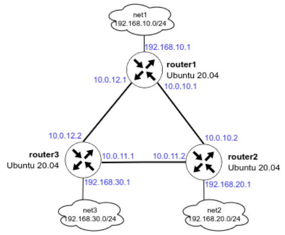

# Домашнee задание 21

# Задание

1. Развернуть 3 виртуальные машины: router1, router2, router3

2. Объединить их разными vlan



- настроить OSPF между машинами на базе Quagga (frr);
- изобразить ассиметричный роутинг;
- сделать один из линков "дорогим", но что бы при этом роутинг был симметричным.

# Решение

<aside>
💡 Некоторое отступление:

Так как мой ПК не поддерживает встроенную виртуализацию Nested VT-x, пришлось добавить еще одну ВМ **ansible** для управления. Так же на хосты была добавлена еще одна сеть - управления через Ansible **192.168.50.0/24**

</aside>

### **Подготовка стенда**

Склонировать репозиторий. Запустить подготовку стенда:

```bash
vagrant up
```

Получим виртуальные машины: router1, router2, router3 и ansible 

Подключаемся к ansible


```bash
vagrant ssh ansible
```

Запускаем настройку ВМ

```bash
cd /vagrant/ansible
vagrant@ansible:/vagrant/ansible$ ansible-playbook provision.yml -i hosts 
```

### **Настройка OSPF и проверка работы**

Для настойки OSPF запускаем play-book provision.yml c хоста управления - ansible

```bash
vagrant@ansible:~$ cd /vagrant/ansible/
vagrant@ansible:/vagrant/ansible$ ansible-playbook provision.yml -i hosts 
```

Проверяем доступность сетей с router1

```bash
vagrant@router1:~$ ping 192.168.10.1 -c 3
PING 192.168.10.1 (192.168.10.1) 56(84) bytes of data.
64 bytes from 192.168.10.1: icmp_seq=1 ttl=64 time=0.023 ms
64 bytes from 192.168.10.1: icmp_seq=2 ttl=64 time=0.043 ms
64 bytes from 192.168.10.1: icmp_seq=3 ttl=64 time=0.042 ms

--- 192.168.10.1 ping statistics ---
3 packets transmitted, 3 received, 0% packet loss, time 2030ms
rtt min/avg/max/mdev = 0.023/0.036/0.043/0.009 ms

vagrant@router1:~$ ping 192.168.20.1 -c 3
PING 192.168.20.1 (192.168.20.1) 56(84) bytes of data.
64 bytes from 192.168.20.1: icmp_seq=1 ttl=64 time=1.35 ms
64 bytes from 192.168.20.1: icmp_seq=2 ttl=64 time=1.10 ms
64 bytes from 192.168.20.1: icmp_seq=3 ttl=64 time=0.872 ms

--- 192.168.20.1 ping statistics ---
3 packets transmitted, 3 received, 0% packet loss, time 2583ms
rtt min/avg/max/mdev = 0.872/1.107/1.353/0.196 ms

vagrant@router1:~$ ping 192.168.30.1 -c 3
PING 192.168.30.1 (192.168.30.1) 56(84) bytes of data.
64 bytes from 192.168.30.1: icmp_seq=1 ttl=64 time=1.25 ms
64 bytes from 192.168.30.1: icmp_seq=2 ttl=64 time=0.497 ms
64 bytes from 192.168.30.1: icmp_seq=3 ttl=64 time=0.725 ms

--- 192.168.30.1 ping statistics ---
3 packets transmitted, 3 received, 0% packet loss, time 2645ms
rtt min/avg/max/mdev = 0.497/0.824/1.252/0.316 ms

vagrant@router1:~$ ping 10.0.10.1 -c 3
PING 10.0.10.1 (10.0.10.1) 56(84) bytes of data.
64 bytes from 10.0.10.1: icmp_seq=1 ttl=64 time=0.069 ms
64 bytes from 10.0.10.1: icmp_seq=2 ttl=64 time=0.038 ms
64 bytes from 10.0.10.1: icmp_seq=3 ttl=64 time=0.039 ms

--- 10.0.10.1 ping statistics ---
3 packets transmitted, 3 received, 0% packet loss, time 2036ms
rtt min/avg/max/mdev = 0.038/0.048/0.069/0.014 ms

vagrant@router1:~$ ping 10.0.11.1 -c 3
PING 10.0.11.1 (10.0.11.1) 56(84) bytes of data.
64 bytes from 10.0.11.1: icmp_seq=1 ttl=64 time=0.623 ms
64 bytes from 10.0.11.1: icmp_seq=2 ttl=64 time=0.671 ms
64 bytes from 10.0.11.1: icmp_seq=3 ttl=64 time=0.693 ms

--- 10.0.11.1 ping statistics ---
3 packets transmitted, 3 received, 0% packet loss, time 2047ms
rtt min/avg/max/mdev = 0.623/0.662/0.693/0.029 ms

vagrant@router1:~$ ping 10.0.12.1 -c 3
PING 10.0.12.1 (10.0.12.1) 56(84) bytes of data.
64 bytes from 10.0.12.1: icmp_seq=1 ttl=64 time=0.067 ms
64 bytes from 10.0.12.1: icmp_seq=2 ttl=64 time=0.039 ms
64 bytes from 10.0.12.1: icmp_seq=3 ttl=64 time=0.042 ms

--- 10.0.12.1 ping statistics ---
3 packets transmitted, 3 received, 0% packet loss, time 2040ms
rtt min/avg/max/mdev = 0.039/0.049/0.067/0.012 ms
```

Все сети доступны

Проверяем таблицу маршрутов ospf

```bash
router1# show ip route ospf
Codes: K - kernel route, C - connected, L - local, S - static,
       R - RIP, O - OSPF, I - IS-IS, B - BGP, E - EIGRP, N - NHRP,
       T - Table, v - VNC, V - VNC-Direct, A - Babel, F - PBR,
       f - OpenFabric, t - Table-Direct,
       > - selected route, * - FIB route, q - queued, r - rejected, b - backup
       t - trapped, o - offload failure

O   10.0.10.0/30 [110/100] is directly connected, eth1, weight 1, 00:19:07
O>* 10.0.11.0/30 [110/200] via 10.0.10.2, eth1, weight 1, 00:18:32
  *                        via 10.0.12.2, eth2, weight 1, 00:18:32
O   10.0.12.0/30 [110/100] is directly connected, eth2, weight 1, 00:19:07
O   192.168.10.0/24 [110/100] is directly connected, eth3, weight 1, 00:19:07
O>* 192.168.20.0/24 [110/200] via 10.0.10.2, eth1, weight 1, 00:18:32
O>* 192.168.30.0/24 [110/200] via 10.0.12.2, eth2, weight 1, 00:18:52
```

Опускаем интерфейс eth2 и проверяем маршруты

```bash
root@router1:~# ifconfig eth2 down
root@router1:~# vtysh

Hello, this is FRRouting (version 10.0).
Copyright 1996-2005 Kunihiro Ishiguro, et al.

router1# show ip route ospf
Codes: K - kernel route, C - connected, L - local, S - static,
       R - RIP, O - OSPF, I - IS-IS, B - BGP, E - EIGRP, N - NHRP,
       T - Table, v - VNC, V - VNC-Direct, A - Babel, F - PBR,
       f - OpenFabric, t - Table-Direct,
       > - selected route, * - FIB route, q - queued, r - rejected, b - backup
       t - trapped, o - offload failure

O   10.0.10.0/30 [110/100] is directly connected, eth1, weight 1, 00:25:44
O>* 10.0.11.0/30 [110/200] via 10.0.10.2, eth1, weight 1, 00:00:59
O>* 10.0.12.0/30 [110/300] via 10.0.10.2, eth1, weight 1, 00:00:59
O   192.168.10.0/24 [110/100] is directly connected, eth3, weight 1, 00:25:44
O>* 192.168.20.0/24 [110/200] via 10.0.10.2, eth1, weight 1, 00:25:09
O>* 192.168.30.0/24 [110/300] via 10.0.10.2, eth1, weight 1, 00:00:59
```

Видим, что изначально маршрут был

`O   10.0.12.0/30 [110/100] is directly connected, eth2, weight 1, 00:19:07`
после выключения eth2 стал:
`O>* 10.0.12.0/30 [110/300] via 10.0.10.2, eth1, weight 1, 00:00:59`

traceroute показывает, что маршрут проходит через router2 (10.0.10.20)

```bash
root@router1:~# traceroute 10.0.12.2
traceroute to 10.0.12.2 (10.0.12.2), 30 hops max, 60 byte packets
 1  10.0.10.2 (10.0.10.2)  13.594 ms  13.133 ms  11.996 ms
 2  10.0.12.2 (10.0.12.2)  11.628 ms  11.237 ms  10.889 ms
```

Сеть net3 (192.168.20.0/24) также доступна через router2

```bash
root@router1:~# traceroute 192.168.30.1
traceroute to 192.168.30.1 (192.168.30.1), 30 hops max, 60 byte packets
 1  10.0.10.2 (10.0.10.2)  9.688 ms  8.327 ms  7.621 ms
 2  192.168.30.1 (192.168.30.1)  10.430 ms  10.037 ms  10.037 ms
```

Все сети доступны.

### **Проверка ассимметричного роутинга**

Смотрим трафик в обычном состоянии.

На router1 запускаем пинги

```bash
vagrant@router1:~$ ping -I 192.168.10.1 192.168.20.1
PING 192.168.20.1 (192.168.20.1) from 192.168.10.1 : 56(84) bytes of data.
64 bytes from 192.168.20.1: icmp_seq=1 ttl=64 time=1.35 ms
64 bytes from 192.168.20.1: icmp_seq=2 ttl=64 time=1.15 ms
64 bytes from 192.168.20.1: icmp_seq=3 ttl=64 time=1.38 ms
```

Смотрим трафик на router2 на интерфейсе eth2

```bash
root@router2:~# tcpdump -i eth1
tcpdump: verbose output suppressed, use -v[v]... for full protocol decode
listening on eth1, link-type EN10MB (Ethernet), snapshot length 262144 bytes
03:23:22.996511 IP 192.168.10.1 > router2: ICMP echo request, id 11, seq 202, length 64
03:23:22.996542 IP router2 > 192.168.10.1: ICMP echo reply, id 11, seq 202, length 64
03:23:24.006452 IP 192.168.10.1 > router2: ICMP echo request, id 11, seq 203, length 64
03:23:24.006482 IP router2 > 192.168.10.1: ICMP echo reply, id 11, seq 203, length 64
03:23:25.016752 IP 192.168.10.1 > router2: ICMP echo request, id 11, seq 204, length 64
03:23:25.016783 IP router2 > 192.168.10.1: ICMP echo reply, id 11, seq 204, length 64
03:23:25.044934 IP router2 > ospf-all.mcast.net: OSPFv2, Hello, length 48
03:23:26.027084 IP 192.168.10.1 > router2: ICMP echo request, id 11, seq 205, length 64
03:23:26.027115 IP router2 > 192.168.10.1: ICMP echo reply, id 11, seq 205, length 64
```

Видим как исходящие запросы, так и входящие ответы пинга, а также служебный пакет Hello протокола ospf.

Для настойки ассиметричного роутинга OSPF правим defaults/main.yml

`symmetric_routing: false`

запускаем play-book assymetric.yml c хоста управления - ansible, который увеличивает «стоимость» маршрута через router1

```bash
vagrant@ansible:/vagrant/ansible$ ansible-playbook assymetric.yml -i hosts 
```

На router1 запускаем пинги

```bash
vagrant@router1:~$ ping -I 192.168.10.1 192.168.20.1
PING 192.168.20.1 (192.168.20.1) from 192.168.10.1 : 56(84) bytes of data.
64 bytes from 192.168.20.1: icmp_seq=1 ttl=64 time=1.35 ms
64 bytes from 192.168.20.1: icmp_seq=2 ttl=64 time=1.15 ms
64 bytes from 192.168.20.1: icmp_seq=3 ttl=64 time=1.38 ms
```

На router2 смотрим трафик на интерфейсах

```bash
root@router2:~# tcpdump -i eth2
tcpdump: verbose output suppressed, use -v[v]... for full protocol decode
listening on eth2, link-type EN10MB (Ethernet), snapshot length 262144 bytes
03:29:16.184119 IP 192.168.10.1 > router2: ICMP echo request, id 11, seq 523, length 64
03:29:17.187460 IP 192.168.10.1 > router2: ICMP echo request, id 11, seq 524, length 64
03:29:18.196704 IP 192.168.10.1 > router2: ICMP echo request, id 11, seq 525, length 64
03:29:19.205992 IP 192.168.10.1 > router2: ICMP echo request, id 11, seq 526, length 64
03:29:20.215026 IP 192.168.10.1 > router2: ICMP echo request, id 11, seq 527, length 64
03:29:21.224212 IP 192.168.10.1 > router2: ICMP echo request, id 11, seq 528, length 64
03:29:21.407243 IP router2 > ospf-all.mcast.net: OSPFv2, Hello, length 48
03:29:21.615296 IP 10.0.11.1 > ospf-all.mcast.net: OSPFv2, Hello, length 48
03:29:22.231778 IP 192.168.10.1 > router2: ICMP echo request, id 11, seq 529, length 64
```

Видим только исходящие запросы пинга, но не видим ответов на них.
А ответы приходят на eth1

```bash
root@router2:~# tcpdump -i eth1
tcpdump: verbose output suppressed, use -v[v]... for full protocol decode
listening on eth1, link-type EN10MB (Ethernet), snapshot length 262144 bytes
03:29:04.025079 IP router2 > 192.168.10.1: ICMP echo reply, id 11, seq 511, length 64
03:29:04.202567 ARP, Request who-has 10.0.10.1 tell router2, length 28
03:29:04.204223 ARP, Reply 10.0.10.1 is-at 08:00:27:04:01:e1 (oui Unknown), length 46
03:29:05.034241 IP router2 > 192.168.10.1: ICMP echo reply, id 11, seq 512, length 64
03:29:06.039517 IP router2 > 192.168.10.1: ICMP echo reply, id 11, seq 513, length 64
03:29:07.092675 IP router2 > 192.168.10.1: ICMP echo reply, id 11, seq 514, length 64
03:29:08.094003 IP router2 > 192.168.10.1: ICMP echo reply, id 11, seq 515, length 64
03:29:09.103218 IP router2 > 192.168.10.1: ICMP echo reply, id 11, seq 516, length 64
03:29:10.112417 IP router2 > 192.168.10.1: ICMP echo reply, id 11, seq 517, length 64
03:29:11.121682 IP router2 > 192.168.10.1: ICMP echo reply, id 11, seq 518, length 64
03:29:11.406451 IP router2 > ospf-all.mcast.net: OSPFv2, Hello, length 48
03:29:11.701129 IP 10.0.10.1 > ospf-all.mcast.net: OSPFv2, Hello, length 48
03:29:12.130868 IP router2 > 192.168.10.1: ICMP echo reply, id 11, seq 519, length 64
```

Ассиметричный роутинг работает.

### **Проверка симметричного роутинга**

Переключаем на симметричный роутинг - правим defaults/main.yml

`symmetric_routing: true`

Запускаем еще раз play-book assymetric.yml c хоста управления - ansible. Теперь «стоимость» маршрута повышена на обоих роутерах.

```bash
vagrant@ansible:/vagrant/ansible$ ansible-playbook assymetric.yml -i hosts 
```

На router1 запускаем пинги

```bash
vagrant@router1:~$ ping -I 192.168.10.1 192.168.20.1
PING 192.168.20.1 (192.168.20.1) from 192.168.10.1 : 56(84) bytes of data.
64 bytes from 192.168.20.1: icmp_seq=1 ttl=63 time=1.79 ms
64 bytes from 192.168.20.1: icmp_seq=2 ttl=63 time=1.37 ms
64 bytes from 192.168.20.1: icmp_seq=3 ttl=63 time=2.93 ms
```

На router2 смотрим трафик на интерфейсах

На eth2

```bash
root@router2:~# tcpdump -i eth2
tcpdump: verbose output suppressed, use -v[v]... for full protocol decode   
listening on eth2, link-type EN10MB (Ethernet), snapshot length 262144 bytes
11:45:34.954202 IP 192.168.10.1 > router2: ICMP echo request, id 16, seq 70, length 64
11:45:34.954231 IP router2 > 192.168.10.1: ICMP echo reply, id 16, seq 70, length 64  
11:45:35.957550 IP 192.168.10.1 > router2: ICMP echo request, id 16, seq 71, length 64
11:45:35.957580 IP router2 > 192.168.10.1: ICMP echo reply, id 16, seq 71, length 64  
11:45:36.076235 ARP, Request who-has router2 tell 10.0.11.1, length 46
11:45:36.076251 ARP, Reply router2 is-at 08:00:27:76:b7:e3 (oui Unknown), length 28
11:45:36.967908 IP 192.168.10.1 > router2: ICMP echo request, id 16, seq 72, length 64
11:45:36.967936 IP router2 > 192.168.10.1: ICMP echo reply, id 16, seq 72, length 64  
11:45:37.977019 IP 192.168.10.1 > router2: ICMP echo request, id 16, seq 73, length 64
11:45:37.977048 IP router2 > 192.168.10.1: ICMP echo reply, id 16, seq 73, length 64  
```

видим запросы и ответы

На eth1

```bash
root@router2:~# tcpdump -i eth1
tcpdump: verbose output suppressed, use -v[v]... for full protocol decode   
listening on eth1, link-type EN10MB (Ethernet), snapshot length 262144 bytes
11:47:10.732957 IP 10.0.10.1 > ospf-all.mcast.net: OSPFv2, Hello, length 48
11:47:10.768718 IP router2 > ospf-all.mcast.net: OSPFv2, Hello, length 48
11:47:20.739129 IP 10.0.10.1 > ospf-all.mcast.net: OSPFv2, Hello, length 48
11:47:20.768819 IP router2 > ospf-all.mcast.net: OSPFv2, Hello, length 48
```

видим только служебный трафик ospf.

На eth1 пинги ходить перестали так как на обоих роутерах на этих портах повышенная стоимость маршрута.

---